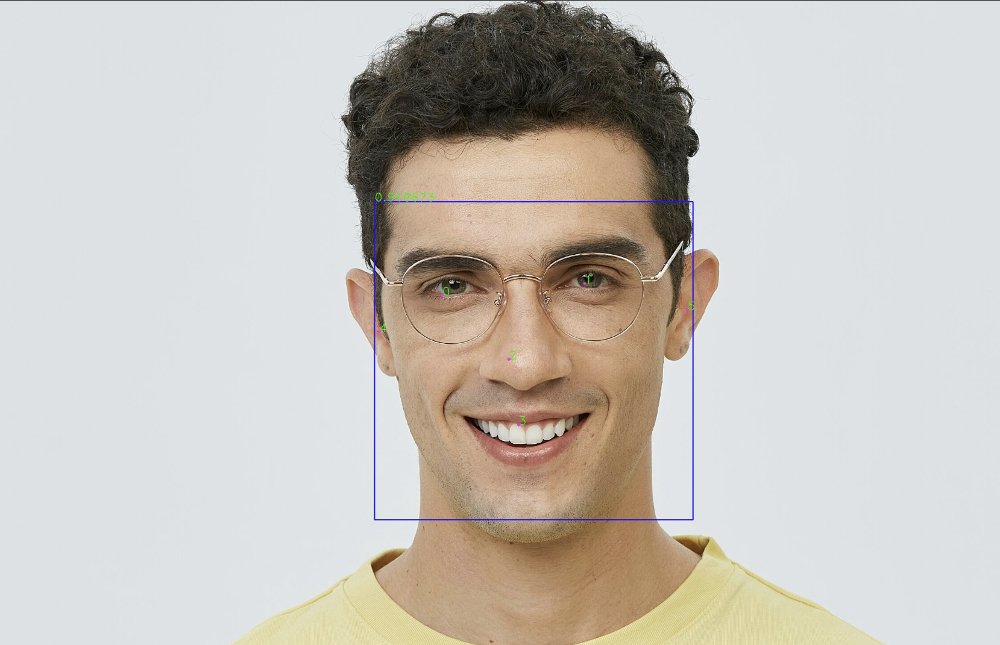
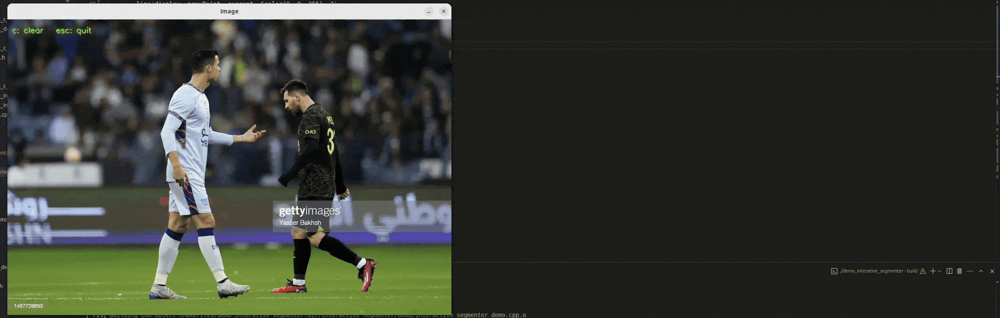

# MediaPipe CMake

<div align="center">

[](LICENSE)
[](https://cmake.org/)
[](https://isocpp.org/)
[](#supported-platforms)

**A high-performance, CMake-based reimplementation of Google MediaPipe for edge devices**

[Features](#-features) • [Demo](#-demo) • [Quick Start](#-quick-start) • [Performance](#-performance) • [Documentation](#-documentation)

</div>

---

## 🎯 Overview

MediaPipe is an excellent framework containing many AI model engineering implementations for edge environments. However, the official MediaPipe only supports Bazel build system, which is incompatible with CMake - the commonly used build system in edge computing.

**MediaPipe CMake** reimplements MediaPipe from scratch using CMake, providing developers with:

- ✅ **CMake Build System** - Easy integration with existing CMake projects
- ✅ **Enhanced Performance** - Up to 40% faster than official implementation (using MNN backend)
- ✅ **Pure C++ Implementation** - No overhead, optimized for production
- ✅ **Multi-Platform Support** - Linux and Android (ARM32/ARM64)
- ✅ **Powered by [OpenCV_lite](https://github.com/zihaomu/opencv_lite)** - Lightweight inference engine with MNN backend

## ✨ Features

This project focuses on reproducing MediaPipe's **Vision** capabilities with the following components:

| Category | Feature | Models | Status |
|----------|---------|--------|--------|
| 👤 **Face** | Face Detection | BlazeFace | ✅ |
| 👤 **Face** | Face Landmarks | 468/478 points | ✅ |
| 👤 **Face** | Face Blendshapes | - | 🚧 WIP |
| 🖐️ **Hand** | Hand Detection | - | ✅ |
| 🖐️ **Hand** | Hand Landmarks | 21 points 3D | ✅ |
| 🧍 **Pose** | Pose Detection | - | ✅ |
| 🧍 **Pose** | Pose Landmarks | 33 points 3D | ✅ |
| 🧍 **Holistic** | Holistic Tracking | Face + Hand + Pose | ✅ |
| 👁️ **Iris** | Iris Tracking | Eye + Iris | ✅ |
| 🎨 **Segmentation** | Selfie Segmentation | - | ✅ |
| 🎨 **Segmentation** | Hair Segmentation | - | ✅ |
| 🎨 **Segmentation** | Interactive Segmentation | - | ✅ |


## 🎬 Demo

This project faithfully reproduces the complete MediaPipe processing pipeline. Below are visual demonstrations of each capability:

<div align="center">

### Face Detection & Landmarks



3D landmark was show by Open3D, and the script can be found at './[viz_face_by_open3d.py](face_landmarker/vis_demo/viz_face_by_open3d.py)'

### Hand Landmarks


3D landmark was show by Open3D, and the script can be found at './[viz_hand_by_open3d.py](hand_landmarker/vis_demo/viz_hand_by_open3d.py)'

### Pose Landmarks


3D landmark was show by Open3D, and the script can be found at './[viz_pose_by_open3d.py](pose_landmarker/vis_demo/viz_pose_by_open3d.py)'

### Iris Tracking


### Interactive Segmentation


</div>


## 🚀 Performance

Compared to the official MediaPipe implementation:

- **Face Landmarks**: ~40% faster
- **CPU Optimized**: MNN backend significantly outperforms TFLite on CPU
- **Memory Efficient**: Pure C++ with minimal overhead
- **Production Ready**: Optimized for real-time edge deployment, C and C++ API


## 🚀 Quick Start

### Prerequisites

- CMake 3.10 or higher
- C++14 compatible compiler
- Git

### Building from Source

#### Step 1: Clone Repositories

```bash
# Clone opencv_lite (dependency)
git clone https://github.com/zihaomu/opencv_lite.git

# Clone this project
git clone https://github.com/zihaomu/mediapipe_cmake.git
```

#### Step 2: Build opencv_lite

The opencv_lite library includes integrated MNN backend for inference.

```bash
cd opencv_lite
mkdir build && cd build
cmake ..
make -j$(nproc)
```

#### Step 3: Configure MediaPipe CMake

Edit `mediapipe_cmake/CMakeLists.txt` and set your opencv_lite build path:

```cmake
# Line 15 in CMakeLists.txt
set(OpenCV_DIR "/path/to/your/opencv_lite/build")
```

#### Step 4: Build MediaPipe CMake

```bash
cd mediapipe_cmake
mkdir build && cd build
cmake ..
make -j$(nproc)
```

#### Step 5: Run Demo

```bash
# Example: Face landmark demo
./face_landmarker/face_landmarker_demo

# Example: Hand landmark demo
./hand_landmarker/hand_landmark_demo

# Example: Pose landmark demo
./pose_landmarker/pose_landmark_demo
```

### Building for Android
Compile OpenCV lite for android platform, please reference [How to compile opencv-lite on android](TODO).

For Android ARM64:
```bash
bash build_android_arm64.sh
```

For Android ARM32:

```bash
bash build_android_arm32.sh
```

**Android Setup Requirements:**

Organize your opencv_lite Android libraries as follows:

```
lib/
├── arm64-v8a/
│   ├── libMNN.so
│   ├── libopencv_core.so
│   ├── libopencv_dnn.so
│   └── libopencv_imgproc.so
├── armeabi-v7a/
│   ├── libMNN.so
│   ├── libopencv_core.so
│   ├── libopencv_dnn.so
│   └── libopencv_imgproc.so
└── include/opencv2/
```

## 📚 Documentation

Each module includes detailed documentation:

- [Face Detector](face_detector/) - Face detection implementation
- [Face Landmarker](face_landmarker/) - 468/478 point face landmarks with C API
- [Hand Detector](hand_detector/) - Hand detection implementation
- [Hand Landmarker](hand_landmarker/) - 21-point hand landmarks with C API
- [Pose Detector](pose_detector/) - Pose detection implementation  
- [Pose Landmarker](pose_landmarker/) - 33-point pose landmarks with C API
- [Holistic Tracker](holistic_tracker/) - Combined face, hand, and pose tracking
- [Iris Tracker](iris_tracker/) - Eye and iris tracking
- [Interactive Segmenter](interactive_segmenter/) - Interactive image segmentation
- [Hair Segmenter](hair_segmenter/) - Hair segmentation
- [Selfie Segmenter](selfie_segmenter/) - Portrait segmentation

### C API Support

Several modules provide C API for easier integration:
- `face_landmark_c_api.h`
- `hand_landmark_c_api.h`
- `pose_landmark_c_api.h`

### Visualization Tools

Python visualization scripts using Open3D:
- [Face Visualization](face_landmarker/vis_demo/viz_face_by_open3d.py)
- [Hand Visualization](hand_landmarker/vis_demo/viz_hand_by_open3d.py)
- [Pose Visualization](pose_landmarker/vis_demo/viz_pose_by_open3d.py)

## 🗺️ Roadmap

- [ ] Add face blendshapes support
- [ ] Support MNN backend for selfie segmenter
- [ ] Enhanced smoothing strategies for pose landmarks
- [ ] Optimize holistic tracker performance
- [ ] Flutter pose landmark demo
- [ ] 3D object detection
- [ ] Detailed reproduction guides for each AI capability
- [ ] Add a all-in-one SDK module, unified interface, C/C++.

## 🤝 Contributing

Contributions are welcome! Please feel free to submit a Pull Request.

## 📄 License

This project is licensed under the Apache License 2.0 - see the [LICENSE](LICENSE) file for details.

## 🙏 Acknowledgments

- [Google MediaPipe](https://github.com/google/mediapipe) - Original MediaPipe framework
- [OpenCV_lite](https://github.com/zihaomu/opencv_lite) - Lightweight OpenCV with modified dnn module
- [MNN](https://github.com/alibaba/MNN) - High-performance inference engine

## 📧 Contact

For questions and support, please open an issue on GitHub.

---

<div align="center">

**If you find this project helpful, please consider giving it a ⭐!**

</div>
